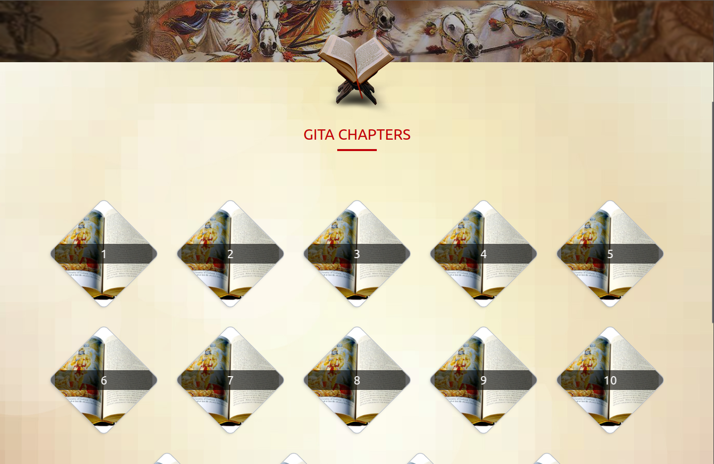

# sv

Everything you need to build a Svelte project, powered by [`sv`](https://github.com/sveltejs/cli).

## Creating a project

If you're seeing this, you've probably already done this step. Congrats!

```sh
# create a new project in the current directory
npx sv create


```

## Developing

Once you've created a project and installed dependencies with `npm install` (or `pnpm install` or `yarn`), start a development server:

```sh
npm run dev

# or start the server and open the app in a new browser tab
npm run dev -- --open


#Thought Process & Project Structure

To make the webpage modular, maintainable, and easy to understand, I divided the codebase into separate files for UI components and API calls.
#Project Structure

routes/+page.svelte
Holds the main layout of the page.

lib/api/gita.js
Contains functions for API calls and returns data in a clean, reusable way.

lib/navbar.svelte
Reusable navigation bar component.

lib/mainContent.svelte
Hero section of the page.
Also responsible for rendering the chapter list and verses.

lib/chapterDetails.svelte
Fetches and displays chapter details using the chapter number.

lib/verseModal.svelte
Modal component that receives verse data through props and displays it.

# Key Principles

Modular Design → Each component has a single responsibility.

Separation of Concerns → API calls are isolated in lib/api/.

Reusability → Components like navbar and modal can be reused anywhere.

Maintainability → Easy to scale and update individual parts without breaking the whole app.
```

### Home Page




# Mobile 


